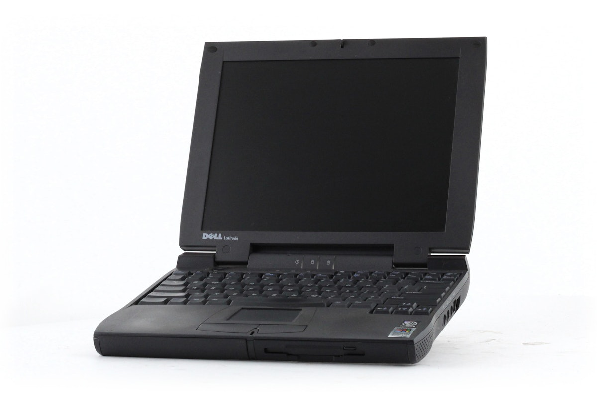
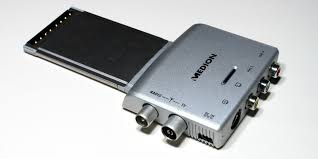
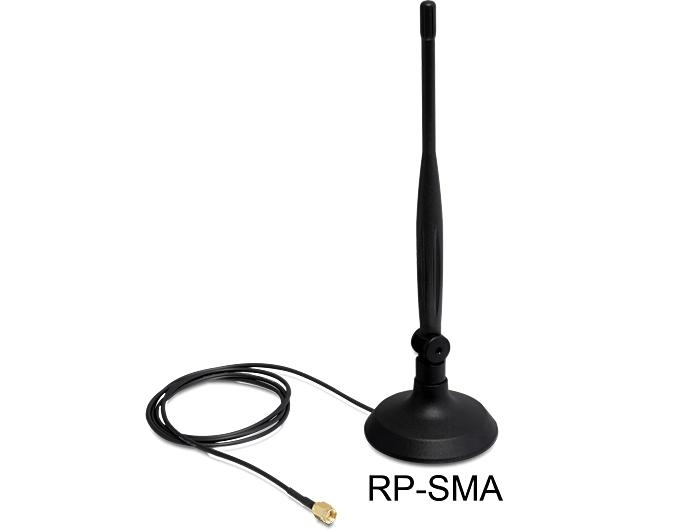

r# Aufgabe 
Hacking-Fall – Analyseaufgabe
Beschreibung:
Dieses Prüfungsimage erfordert eine Vielzahl von Fähigkeiten, um die gestellten Fragen
korrekt beantworten zu können.
� Szenario:
Am 20.09.2004 wurde ein Dell-Notebook des Typs CPi mit der Seriennummer VLQLW
aufgefunden. Es lag verlassen da, zusammen mit einer drahtlosen PCMCIA-Karte und einer
selbstgebauten 802.11b-Antenne. Es besteht der Verdacht, dass dieses Gerät für HackingZwecke verwendet wurde. Es konnte bislang jedoch nicht eindeutig mit dem Verdächtigen
Greg Schardt in Verbindung gebracht werden. (Hinweis: Der Name wird hier bewusst mit
Sonderzeichen geschrieben, um eine Indexierung durch Suchmaschinen zu vermeiden. In den
Dateien selbst gibt es jedoch keine Sonderzeichen.)
Greg Schardt ist im Internet unter dem Alias „Mr. Evil“ bekannt. Bekannte von ihm
berichteten, dass er sein Fahrzeug oft in Reichweite von öffentlichen WLAN-Zugangspunkten
(z. B. Starbucks oder andere T-Mobile-Hotspots) parkte, um dort Internetdatenverkehr
abzufangen. Ziel war es offenbar, an Kreditkartennummern, Benutzernamen und
Passwörter zu gelangen.
Aufgabe:
Untersuchen Sie das System auf Hacking-Software, Hinweise auf deren Verwendung und
generierte Daten. Versuchen Sie, das System mit dem Verdächtigen Greg Schardt in
Verbindung zu bringen.
Ein DD-Image (in acht Teilen: 1 bis 8 sowie Notizen) sowie ein EnCase-Image (zweiter Teil)
des sichergestellten Computers liegen vor.
---

# Ausgangslage. 

Hardware wurde aufgefunden. Es wird vermutet dass jene von einer person zu hacking zwecken missbraucht wurde. 
## Hardware 
Folgende hardware wurde aufgefunden. Beispielbilder entsprechen den ungefähren hardware modellen. 
### Laptop 
DELL CPi seriennumer VLQLW

### PCMCIA-Karte

### 802 11b wireless antenna

# 1. merge files
the linux 'cat' binary can be used to merge files. 

`cat file1.sec file2.sec file3.sec file4.sec file5.sec file6.sec file7.sec file8.sec > merged.sec`

`cat SCHARDT001.sec \
SCHARDT002.sec \
SCHARDT003.sec \
SCHARDT004.sec \
SCHARDT005.sec \
SCHARDT006.sec \
SCHARDT007.sec \
SCHARDT008.sec > SCHARDT_001_008_merged.sec`

# check shasum of merged file 
depending on the algorithm the hash can be checked with 

`sha256sum SCHARDT_001_008_merged.sec`
65e2002fed0b286f49541c7e97dcec0dda913d51a063ceeed86782bdacda2312  SCHARDT_001_008_merged.sec

`md5sum SCHARDT_001_008_merged.sec`
aee4fcd9301c03b3b054623ca261959a  SCHARDT_001_008_merged.sec

`sha1sum SCHARDT_001_008_merged.sec`
da2fe30fe21711edf42310873af475859a68f300  SCHARDT_001_008_merged.sec

`sha512sum SCHARDT_001_008_merged.sec`
e07390a4ec8edfaa151c091633ca61f989a4d91b26467d4d48d3a5ac73e7d9833b1725b06184e66c5d40da6384ed4c49c6c6eb7c707e4b42ed0682dccc40cb19  SCHARDT_001_008_merged.sec

(Du kannst auch md5sum, sha1sum, oder sha512sum verwenden, je nach benötigtem Algorithmus.)

# get file infos
`file SCHARDT_001_008_merged.sec `
SCHARDT_001_008_merged.sec: DOS/MBR boot sector MS-MBR XP english at offset 0x12c "Invalid partition table" at offset 0x144 "Error loading operating system" at offset 0x163 "Missing   operating system", disk signature 0xec5dec5d; partition 1 : ID=0x7, active, start-CHS (0x0,1,1), end-CHS (0x24f,254,63), startsector 63, 9510417 sectors

If output says data (raw/unknown), further analysis is needed (try binwalk or fdisk). 

# check for filesystem 
`fdisk -l SCHARDT_001_008_merged.sec`
Disk SCHARDT_001_008_merged.sec: 4,54 GiB, 4871301120 bytes, 9514260 sectors
Units: sectors of 1 * 512 = 512 bytes
Sector size (logical/physical): 512 bytes / 512 bytes
I/O size (minimum/optimal): 512 bytes / 512 bytes
Disklabel type: dos
Disk identifier: 0xec5dec5d

Device                      Boot Start     End Sectors  Size Id Type
SCHARDT_001_008_merged.sec1 *       63 9510479 9510417  4,5G  7 HPFS/NTFS/exFAT

# what os is on the .sec file

`file filename` reveals '...DOS/MBR boot sector MS-MBR XP english at offset 0x12c...'

# try to mount entire image ( automatic)
`sudo losetup -fP --show SCHARDT_001_008_merged.sec`

This assigns a loop device (e.g., /dev/loop0).

## check partitions
lsblk

loop33        7:33   0   4,5G  0 loop 
└─loop33p1  259:3    0   4,5G  0 part 

# mount a partition
`sudo mkdir /mnt/SCHARDT_001_008`
`sudo mount /dev/loop33 /mnt/SCHARDT_001_008`
mount: /mnt/SCHARDT_001_008: wrong fs type, bad option, bad superblock on /dev/loop33, missing codepage or helper program, or other error.

The error you're encountering (wrong fs type, bad superblock) typically occurs when:

The filesystem is corrupted, encrypted, or not recognized.

You're trying to mount the wrong partition or entire image instead of a specific filesystem.

The filesystem type isn't specified (e.g., ext4, ntfs).

# verify if loop33 is assigned to the file 
`sudo losetup -l`

/dev/loop33         0      0         0  0 /home/zenbookuser/code/cys/SCHARDT_001_008_merged.sec     0     512

`sudo fdisk -l /dev/loop33`
Disk /dev/loop33: 4,54 GiB, 4871301120 bytes, 9514260 sectors
Units: sectors of 1 * 512 = 512 bytes
Sector size (logical/physical): 512 bytes / 512 bytes
I/O size (minimum/optimal): 512 bytes / 512 bytes
Disklabel type: dos
Disk identifier: 0xec5dec5d

Device        Boot Start     End Sectors  Size Id Type
/dev/loop33p1 *       63 9510479 9510417  4,5G  7 HPFS/NTFS/exFAT

# force mount with filesystem 
`sudo mount -t ntfs /dev/loop33 /mnt/SCHARDT_001_008`
NTFS signature is missing.
Failed to mount '/dev/loop33': Invalid argument
The device '/dev/loop33' doesn't seem to have a valid NTFS.
Maybe the wrong device is used? Or the whole disk instead of a
partition (e.g. /dev/sda, not /dev/sda1)? Or the other way around?

# check for filesystem corruption
`sudo fsck.{type} -f /dev/loop33`
`sudo fsck.ntfs -f /dev/loop33`
`sudo ntfsfix /dev/loop33`
 sudo ntfsfix /dev/loop33
Mounting volume... NTFS signature is missing.
FAILED
Attempting to correct errors... NTFS signature is missing.
FAILED
Failed to startup volume: Invalid argument
NTFS signature is missing.
Trying the alternate boot sector
Unrecoverable error
Volume is corrupt. You should run chkdsk.

# map or mount the partition itself 
`sudo apt install kpartx`
`sudo kpartx -av /dev/loop33`
then check 
`sudo file -s /dev/mapper/loop33p1`
/dev/mapper/loop33p1: symbolic link to ../dm-0

now check the actual partition content 
`sudo file -s /dev/dm-0`

now  
`sudo ntfsfix /dev/dm-0`
Mounting volume... OK
Processing of $MFT and $MFTMirr completed successfully.
Checking the alternate boot sector... OK
NTFS volume version is 3.1.
NTFS partition /dev/dm-0 was processed successfully.

now mount 
`sudo mount -t ntfs-3g /dev/dm-0 /mnt/SCHARDT_001_008`

# browse mounted files
use the simpmle denojs script to apply the 'reglookup' command to all hive files 
`deno run -A deno_reglookup.js`
then use vscode ctrl+f to find for interesting strings such as 'InstallDate'

## When was the os installed 
ctrl + f 'InstallDate'
ctrl + shift + l to select all matches
finds : 
/cybersecurity_project/WINDOWS_system32_config_software.txt
`/Microsoft/Windows/CurrentVersion/Installer/UserData/S-1-5-18/Products/0B79C053C7D38EE4AB9A00CB3B5D2472/InstallProperties/InstallDate,SZ,20040819,
/Microsoft/Windows/CurrentVersion/Installer/UserData/S-1-5-18/Products/111E13C6BB69CDA4C9186E3DEEDD8D3D/InstallProperties/InstallDate,SZ,20040820,
/Microsoft/Windows/CurrentVersion/Uninstall/WinPcapInst/InstallDate,SZ,08/27/2004,
/Microsoft/Windows/CurrentVersion/Uninstall/{350C97B0-3D7C-4EE8-BAA9-00BCB3D54227}/InstallDate,SZ,20040819,
/Microsoft/Windows/CurrentVersion/Uninstall/{6C31E111-96BB-4ADC-9C81-E6D3EEDDD8D3}/InstallDate,SZ,20040820,
/Microsoft/Windows NT/CurrentVersion/InstallDate,DWORD,0x41252E3B,
`
the most relevant is 'InstallDate,SZ,20040820,
/Microsoft/Windows NT/CurrentVersion/InstallDate,DWORD,0x41252E3B'
the hexavalue is a unix timestamp and can be converted with
`date -d @$(printf "%d" 0x41252E3B)`
which reveals :Thursday, August 19, 2004 10:48:27 PM

## timezone information 

ctrl + f 'TimeZoneInformation'
ctrl + shift + l 
finds: 
'/ControlSet001/Control/TimeZoneInformation,KEY,,2004-08-19 17:20:02
/ControlSet001/Control/TimeZoneInformation/Bias,DWORD,0x00000168,
/ControlSet001/Control/TimeZoneInformation/StandardName,SZ,Central Standard Time,
/ControlSet001/Control/TimeZoneInformation/StandardBias,DWORD,0x00000000,
/ControlSet001/Control/TimeZoneInformation/StandardStart,BINARY,%00%00%0A%00%05%00%02%00%00%00%00%00%00%00%00%00,
/ControlSet001/Control/TimeZoneInformation/DaylightName,SZ,Central Daylight Time,
/ControlSet001/Control/TimeZoneInformation/DaylightBias,DWORD,0xFFFFFFC4,
/ControlSet001/Control/TimeZoneInformation/DaylightStart,BINARY,%00%00%04%00%01%00%02%00%00%00%00%00%00%00%00%00,
/ControlSet001/Control/TimeZoneInformation/ActiveTimeBias,DWORD,0x0000012C,
/ControlSet002/Control/TimeZoneInformation,KEY,,2004-08-19 17:20:02
/ControlSet002/Control/TimeZoneInformation/Bias,DWORD,0x00000168,
/ControlSet002/Control/TimeZoneInformation/StandardName,SZ,Central Standard Time,
/ControlSet002/Control/TimeZoneInformation/StandardBias,DWORD,0x00000000,
/ControlSet002/Control/TimeZoneInformation/StandardStart,BINARY,%00%00%0A%00%05%00%02%00%00%00%00%00%00%00%00%00,
/ControlSet002/Control/TimeZoneInformation/DaylightName,SZ,Central Daylight Time,
/ControlSet002/Control/TimeZoneInformation/DaylightBias,DWORD,0xFFFFFFC4,
/ControlSet002/Control/TimeZoneInformation/DaylightStart,BINARY,%00%00%04%00%01%00%02%00%00%00%00%00%00%00%00%00,
/ControlSet002/Control/TimeZoneInformation/ActiveTimeBias,DWORD,0x0000012C,
'
which accordint to deepSeek reveals 
Based on the registry data from /ControlSet001/Control/TimeZoneInformation, here are the configured timezone settings:

1. Timezone Information
Standard Time Name: Central Standard Time (CST)

Daylight Saving Time Name: Central Daylight Time (CDT)

Base UTC Offset (Bias): 0x00000168 (360 minutes = UTC-6:00)

Daylight Saving Bias: 0xFFFFFFC4 (-60 minutes = UTC-5:00 during DST)

2. Daylight Saving Time (DST) Rules
Standard Time Start:

Month: 0x0A (October)

Week: 0x05 (Last week)

Day: 0x02 (Sunday)

Time: 02:00 AM (switches from CDT to CST)

Daylight Saving Time Start:

Month: 0x04 (April)

Week: 0x01 (First week)

Day: 0x02 (Sunday)

Time: 02:00 AM (switches from CST to CDT)

3. Current Time Bias (ActiveTimeBias)
ActiveTimeBias: 0x0000012C (300 minutes = UTC-5:00)

This suggests the system was last running in Daylight Saving Time (CDT, UTC-5) before shutdown.

4. Summary of Timezone Settings
Setting	Value	Interpretation
Standard Time	Central Standard Time (CST)	UTC-6:00 (Winter)
Daylight Time	Central Daylight Time (CDT)	UTC-5:00 (Summer)
Standard Start	Last Sun of Oct, 2:00 AM	Switch to CST
Daylight Start	First Sun of Apr, 2:00 AM	Switch to CDT
Last Active Bias	UTC-5:00 (CDT)	System was in DST
5. Geographic Implications
This configuration matches the Central Time Zone (US & Canada), including:

Chicago, Dallas, Houston, Mexico City

Used in parts of the United States, Canada, and Mexico

6. Forensic Significance
The system was likely used in North America (Central Time Zone).

The last active bias (UTC-5:00) suggests the system was shut down during Daylight Saving Time (April–October).

This aligns with the August 2004 installation date (summer time).

## 5. Wer ist als registrierter Besitzer des Systems eingetragen? (Registered owner)

ctrl + f 'RegisteredOwner'
ctrl + shift + l 
'/Microsoft/Windows NT/CurrentVersion/RegisteredOwner,SZ,Greg Schardt,'

## Wie lautet der Name des Benutzerkontos? (User account name)
cybersecurity_project/hive_decoded/_mnt_SCHARDT_001_008_WINDOWS_system32_config_SAM.txt
contains:
'
/SAM/Domains/Account/Users/Names,KEY,,2004-08-19 23:03:54
/SAM/Domains/Account/Users/Names/,NONE,(null),
/SAM/Domains/Account/Users/Names/Administrator,KEY,,2004-08-19 16:59:24
/SAM/Domains/Account/Users/Names/Administrator/,0x000001F4,(null),
/SAM/Domains/Account/Users/Names/Guest,KEY,,2004-08-19 16:59:24
/SAM/Domains/Account/Users/Names/Guest/,0x000001F5,(null),
/SAM/Domains/Account/Users/Names/HelpAssistant,KEY,,2004-08-19 22:28:24
/SAM/Domains/Account/Users/Names/HelpAssistant/,0x000003E8,(null),
/SAM/Domains/Account/Users/Names/Mr. Evil,KEY,,2004-08-19 23:03:54
/SAM/Domains/Account/Users/Names/Mr. Evil/,0x000003EB,(null),
/SAM/Domains/Account/Users/Names/SUPPORT_388945a0,KEY,,2004-08-19 22:35:19
/SAM/Domains/Account/Users/Names/SUPPORT_388945a0/,0x000003EA,(null),
'
interesting here is the entry
/SAM/Domains/Account/Users/Names/Mr. Evil,KEY,,2004-08-19 23:03:54
which suggests a user with the name 'Mr. Evil' that may have been created '2004-08-19 23:03:54'
in the evening of the day the OS was installed
(Thursday, August 19, 2004 10:48:27 PM)

# what is the primary ADDS domain
/cybersecurity_project/hive_decoded/_mnt_SCHARDT_001_008_WINDOWS_system32_config_system.txt contains
/ControlSet001/Control/Lsa/disabledomaincreds,DWORD,0x00000000,
/ControlSet001/Control/Lsa/Kerberos/Domains,KEY,,2004-08-19 17:01:59
/ControlSet001/Control/Terminal Server/DefaultUserConfiguration/Domain,SZ,,
/ControlSet001/Control/Terminal Server/WinStations/Console/Domain,SZ,,
/ControlSet001/Control/Terminal Server/WinStations/RDP-Tcp/Domain,SZ,,
/ControlSet001/Services/Browser/Parameters/IsDomainMaster,SZ,FALSE,
/ControlSet001/Services/Dhcp/Parameters/Options/15/RegLocation,MULTI_SZ,SYSTEM\CurrentControlSet\Services\Tcpip\Parameters\Interfaces\?\DhcpDomain|SYSTEM\CurrentControlSet\Services\TcpIp\Parameters\DhcpDomain,
/ControlSet001/Services/Dnscache/Description,SZ,Resolves and caches Domain Name System (DNS) names for this computer. If this service is stopped%2C this computer will not be able to resolve DNS names and locate Active Directory domain controllers. If this service is disabled%2C any services that explicitly depend on it will fail to start.,
/ControlSet001/Services/Eventlog/Security/LSA/ObjectNames/TrustedDomainObject,DWORD,0x00001620,
/ControlSet001/Services/Eventlog/Security/Security Account Manager/ObjectNames/SAM_DOMAIN,DWORD,0x00001510,
/ControlSet001/Services/lanmanworkstation/parameters/OtherDomains,MULTI_SZ,,
/ControlSet001/Services/Netlogon/Description,SZ,Supports pass-through authentication of account logon events for computers in a domain.,
/ControlSet001/Services/Tcpip/Parameters/Domain,SZ,,
/ControlSet001/Services/Tcpip/Parameters/UseDomainNameDevolution,DWORD,0x00000001,
/ControlSet001/Services/Tcpip/Parameters/Interfaces/{6E4090C2-FAEF-489A-8575-505D21FC1049}/Domain,SZ,,
/ControlSet001/Services/Tcpip/Parameters/Interfaces/{86FC0C96-3FF2-4D59-9ABA-C602F213B5D2}/Domain,SZ,,
/ControlSet001/Services/TrkWks/Description,SZ,Maintains links between NTFS files within a computer or across computers in a network domain.,
/ControlSet002/Control/Lsa/disabledomaincreds,DWORD,0x00000000,
/ControlSet002/Control/Lsa/Kerberos/Domains,KEY,,2004-08-19 17:01:59
/ControlSet002/Control/Terminal Server/DefaultUserConfiguration/Domain,SZ,,
/ControlSet002/Control/Terminal Server/WinStations/Console/Domain,SZ,,
/ControlSet002/Control/Terminal Server/WinStations/RDP-Tcp/Domain,SZ,,
/ControlSet002/Services/Browser/Parameters/IsDomainMaster,SZ,FALSE,
/ControlSet002/Services/Dhcp/Parameters/Options/15/RegLocation,MULTI_SZ,SYSTEM\CurrentControlSet\Services\Tcpip\Parameters\Interfaces\?\DhcpDomain|SYSTEM\CurrentControlSet\Services\TcpIp\Parameters\DhcpDomain,
/ControlSet002/Services/Dnscache/Description,SZ,Resolves and caches Domain Name System (DNS) names for this computer. If this service is stopped%2C this computer will not be able to resolve DNS names and locate Active Directory domain controllers. If this service is disabled%2C any services that explicitly depend on it will fail to start.,
/ControlSet002/Services/Eventlog/Security/LSA/ObjectNames/TrustedDomainObject,DWORD,0x00001620,
/ControlSet002/Services/Eventlog/Security/Security Account Manager/ObjectNames/SAM_DOMAIN,DWORD,0x00001510,
/ControlSet002/Services/lanmanworkstation/parameters/OtherDomains,MULTI_SZ,,
/ControlSet002/Services/Netlogon/Description,SZ,Supports pass-through authentication of account logon events for computers in a domain.,
/ControlSet002/Services/Tcpip/Parameters/Domain,SZ,,
/ControlSet002/Services/Tcpip/Parameters/UseDomainNameDevolution,DWORD,0x00000001,
/ControlSet002/Services/Tcpip/Parameters/Interfaces/{6E4090C2-FAEF-489A-8575-505D21FC1049}/Domain,SZ,,
/ControlSet002/Services/TrkWks/Description,SZ,Maintains links between NTFS files within a computer or across computers in a network domain.,

## How many users? 
cybersecurity_project/hive_decoded/_mnt_SCHARDT_001_008_WINDOWS_system32_config_SAM.txt
contains:
'
/SAM/Domains/Account/Users/Names,KEY,,2004-08-19 23:03:54
/SAM/Domains/Account/Users/Names/,NONE,(null),
/SAM/Domains/Account/Users/Names/Administrator,KEY,,2004-08-19 16:59:24
/SAM/Domains/Account/Users/Names/Administrator/,0x000001F4,(null),
/SAM/Domains/Account/Users/Names/Guest,KEY,,2004-08-19 16:59:24
/SAM/Domains/Account/Users/Names/Guest/,0x000001F5,(null),
/SAM/Domains/Account/Users/Names/HelpAssistant,KEY,,2004-08-19 22:28:24
/SAM/Domains/Account/Users/Names/HelpAssistant/,0x000003E8,(null),
/SAM/Domains/Account/Users/Names/Mr. Evil,KEY,,2004-08-19 23:03:54
/SAM/Domains/Account/Users/Names/Mr. Evil/,0x000003EB,(null),
/SAM/Domains/Account/Users/Names/SUPPORT_388945a0,KEY,,2004-08-19 22:35:19
/SAM/Domains/Account/Users/Names/SUPPORT_388945a0/,0x000003EA,(null),
'
suggests
KEY
Administrator
Guest
Guest
HelpAssistant
Mr. Evil
SUPPORT_388945a0
SUPPORT_388945a0

## welcher benutzer nutzt computer am haefigsten? 
/mnt/SCHARDT_001_008$ ls -lt "Documents and Settings"/*/Recent
'Documents and Settings/Mr. Evil/Recent':
total 6
-rwxrwxrwx 2 root root 460 ago 26  2004 'Temp on m1200 (4.12.220.254).lnk'
-rwxrwxrwx 1 root root 575 ago 26  2004  yng13.lnk
-rwxrwxrwx 2 root root 582 ago 20  2004 'channels (2).lnk'
-rwxrwxrwx 1 root root 759 ago 20  2004  channels.lnk
-rwxrwxrwx 2 root root 333 ago 20  2004  GhostWare.lnk
-rwxrwxrwx 1 root root 459 ago 20  2004  Receipt.lnk
-rwxrwxrwx 2 root root 339 ago 20  2004  Anonyymizer.lnk
-rwxrwxrwx 1 root root 458 ago 20  2004  keys.lnk
-rwxrwxrwx 1 root root 150 ago 20  2004  Desktop.ini

## welcher benutzer war zuletzt angemeldet?
grep -i 'DefaultUserName' ./hive_decoded/*
./hive_decoded/_mnt_SCHARDT_001_008_WINDOWS_system32_config_software.sav.txt:/Microsoft/Windows NT/CurrentVersion/Winlogon/DefaultUserName,SZ,,
./hive_decoded/_mnt_SCHARDT_001_008_WINDOWS_system32_config_software.txt:/Microsoft/Windows NT/CurrentVersion/Winlogon/DefaultUserName,SZ,Mr. Evil,
./hive_decoded/_mnt_SCHARDT_001_008_WINDOWS_system32_config_software.txt:/Microsoft/Windows NT/CurrentVersion/Winlogon/AltDefaultUserName,SZ,Mr. Evil,
